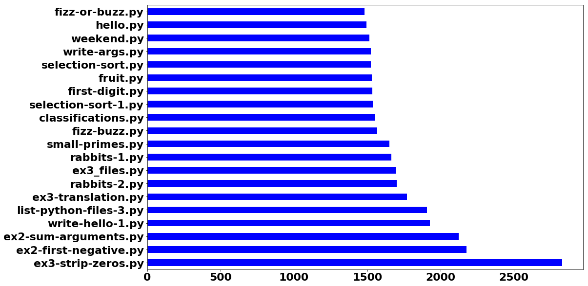
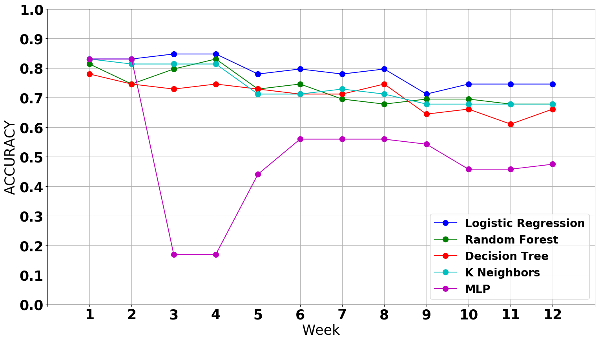
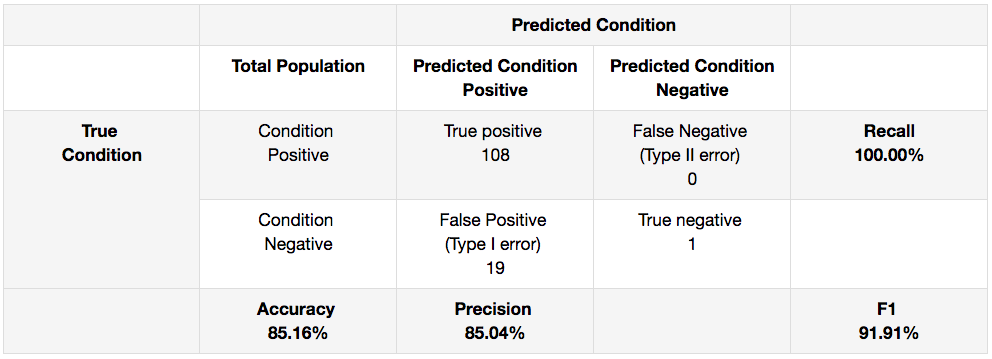

# Educational Data Mining Predictive Modeling for Student Data

This repo presents a new research methodology to automatically detect *students at-risk* of failing a computer-based examination in computer programming modules (courses). By leveraging historical student data, we built predictive models using students' offline (**static**) resources including student characteristics and demographics, and online (**dynamic**) resources using programming and behavioural logs. Predictions are generated weekly during semester and evaluated afterwards.

Please consider citing the following if you use any of the work:
```
@article{azcona2019detecting,
  title={Detecting students-at-risk in computer programming classes with learning analytics from students’ digital footprints},
  author={Azcona, David and Hsiao, I-Han and Smeaton, Alan F},
  journal={User Modeling and User-Adapted Interaction},
  pages={1--30},
  publisher={Springer}
}
```

## Technologies

* Python
* [numpy](https://www.numpy.org/)
* [scipy](https://www.scipy.org/)
* [Pandas](https://pandas.pydata.org/)
* [Matplotlib](https://matplotlib.org/)
* [scikit-learn](https://scikit-learn.org/)
* [Jupyter](https://jupyter.org/)

## Code

1. Data Collection: 
   * Programming work
   * Web interactions & events
   * [Demographics](src/notebooks/1.%20Data%20Collection.%20Extracting%20demographics.ipynb)
   * Academic grades
2. Exploratory Data Analysis:
   * [Programming work](src/notebooks/2.%20EDA.%20Exploring%20Programming%20work.ipynb)
   * [Web interactions & events](src/notebooks/2.%20EDA.%20Exploring%20Web%20data.ipynb)
   * [Programming + Web](src/notebooks/2.%20EDA.%20Exploring%20Web%20%26%20Programming's%20activity.ipynb)
   * [Demographics](src/notebooks/2.%20EDA.%20Exploring%20Demographics.ipynb)
   * [Academic grades](src/notebooks/2.%20EDA.%20Exploring%20Academics.ipynb)
3. Handcrafting Features:
   * [Features](src/notebooks/3.%20Features%20(handcrafting).ipynb)
4. Measure correlations:
   * [Correlations](src/notebooks/4.%20Scatter%20plots%20%26%20Correlations.ipynb)
5. Split Data into Training, Validation and Test:
   * [Split data](src/notebooks/5.%20Split%20data%20into%20train%20%26%20test%20sets.ipynb)
6. Model Selection:
   * [Empirical Risk Minimization](src/notebooks/6.%20Model%20Selection.%20Empirical%20Risk.ipynb)
   * [Hyperparameter Tuning](src/notebooks/6.%20Model%20Selection.%20Hyperparameter%20Tuning.ipynb)
7. Predictions in real time!
   * [Predict](src/notebooks/7.%20Predictions%20for%20incoming%20students.ipynb)
8. Evaluation:
   * [Evaluate](src/notebooks/8.%20Evaluation.ipynb) 

You can always view a notebook using https://nbviewer.jupyter.org/

## Deployment

### Virtual Environment using Bash

1. Creation of a virtual environments done by executing the command venv
2. Command to activate virtual environment
3. Install dependencies
4. List the libraries installed on your environment
5. Do your work!
6. When you are done, the command to deactivate virtual environment
```
$ python3 -m venv env/
$ source env/bin/activate
(env) $ pip install -r requirements.txt
(env) $ pip freeze
(env) $ jupyter notebook
(env) $ ...
(env) $ deactivate
```

## Figures

**Exploring Passing & Failing Rates for CA114:**


**Exploring the TOP 20 most-submitted tasks:**


**Exploring Programming & Web activity on 2017/2018 academic year:**


**Selecting a model: Empirical Risk Minimization approach**


**Selecting a model: Hyperparameter Tuning**


**Evaluating predictions: First laboratory exam**:

